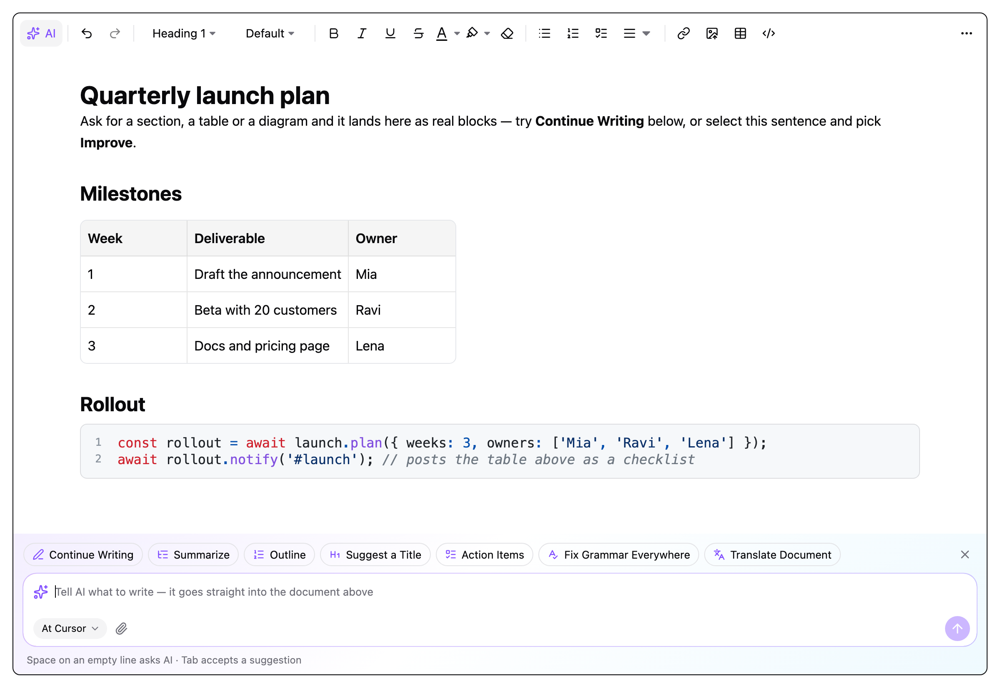

<p align="center">
  
</p>

<h1 align="center">AI Richtext Editor</h1>

<p align="center">
  <b>The rich-text editor that writes with you.</b><br/>
  An AI-first editor SDK on Tiptap: streaming answers become real headings, tables and code blocks; formulas and diagrams are generated from a sentence.<br/>
  Toolbar, bubble menus, slash commands, 16 languages, session replay. React UI today, framework-agnostic core.
</p>

<p align="center">
  <a href="https://www.npmjs.com/package/ai-richtext-editor"></a>
  <a href="./LICENSE"></a>
  <a href="./README.zh-CN.md">中文文档</a>
</p>



## Why this editor

**AI is a first-class feature, not a plugin bolted on.**

- **Streams into the document.** Select text or type `/ai`; the answer streams in and is rendered through the editor's own schema, so a markdown table becomes *the editor's* table, a fenced block a real code block, `- [ ]` a task list. Apply inserts nodes, not pasted text.
- **Generates what you cannot type.** Katex and Mermaid dialogs take a sentence ("the quadratic formula", "a login flow") and write the source, live.
- **Your model, your rules.** OpenAI or Anthropic protocol, any base URL or proxy, or your own `generate(request, onChunk)` transport. Translate to the browser language, refine with a follow-up, attach images and files.
- **Yours to render.** `renderResult` restyles the answer; `components.Panel` replaces the whole dialog.

**And everything else a document needs**

- **Composable.** You create the Tiptap editor, pick the extensions, and place the React controls where you want them — one import per feature.
- **Complete.** 50+ extensions: headings, lists, tables with rounded corners and caret exit, code blocks with language detection, images with cropping, captions and upload tracking, dividers with editable captions, columns, callouts, details, Katex, Mermaid, Excalidraw, video, iframe, attachments, emoji, mentions, table of contents, search & replace, Word/PDF/Markdown import and export.
- **Pastes right.** Web pages, Excel, Google Docs and Word keep their formatting; Word's fake lists become lists and code from VS Code becomes a code block.
- **16 languages** ordered by speaker population, loadable on demand, with matching CJK, Devanagari and Bengali fonts.
- **Record and replay** any writing session as timestamped steps.
- **Framework-agnostic core.** The document logic — extensions, commands, paste rules, AI client and markdown rendering, recorder — has no React in it and is published as `ai-richtext-editor/core` for Vue and other Tiptap bindings. See [Frameworks](./docs/guide/frameworks.md).
- **Fits your design system.** Prefixed Tailwind classes and a handful of CSS variables.

## Install

```bash
pnpm add ai-richtext-editor @tiptap/react @tiptap/pm @tiptap/extension-document @tiptap/extension-paragraph @tiptap/extension-text
```

Keep every `@tiptap/*` package on one version (this repository uses `^3.29`).

## Quick start

```tsx
import { EditorContent, useEditor } from '@tiptap/react';
import { Document } from '@tiptap/extension-document';
import { Paragraph } from '@tiptap/extension-paragraph';
import { Text } from '@tiptap/extension-text';
import { RichTextProvider, RichTextToolbar, RichTextToolbarDivider } from 'ai-richtext-editor';
import { Bold, RichTextBold } from 'ai-richtext-editor/bold';
import { Heading, RichTextHeading } from 'ai-richtext-editor/heading';
import { Table, RichTextTable } from 'ai-richtext-editor/table';
import { RichTextBubbleText } from 'ai-richtext-editor/bubble/text';
import 'ai-richtext-editor/style.css';

export function Editor() {
  const editor = useEditor({
    extensions: [Document, Paragraph, Text, Bold, Heading, Table],
    content: '<p>Hello</p>',
    immediatelyRender: false,
  });

  if (!editor) return null;

  return (
    <RichTextProvider editor={editor}>
      <RichTextToolbar>
        <RichTextHeading />
        <RichTextToolbarDivider />
        <RichTextBold />
        <RichTextTable />
      </RichTextToolbar>
      <RichTextBubbleText />
      <EditorContent editor={editor} />
    </RichTextProvider>
  );
}
```

Every feature is one import: the extension and its control come from the same subpath (`ai-richtext-editor/<feature>`), bubble menus from `ai-richtext-editor/bubble/<name>`, languages from `ai-richtext-editor/locales/<code>`.

## Documentation

The `docs/` folder is a VitePress site (`pnpm docs:dev`). Start with:

- [Getting started](./docs/guide/getting-started.md) — install, minimal editor, composing the UI
- [Features](./docs/guide/features.md) — every extension, its import path and main options
- [Toolbar](./docs/guide/toolbar.md) and [Customization](./docs/guide/customization.md) — custom menus, custom blocks, saving, replay
- [Bubble menus](./docs/guide/bubble-menu.md) · [Internationalization](./docs/guide/internationalization.md)
- [AI](./docs/extensions/AI/index.md) — providers, streaming, markdown rendering, custom panels

## Playground

```bash
pnpm install
pnpm build:lib
pnpm playground
```

The playground imports the built `lib/`; rebuild after changing `src/`. Without an API key the AI menu answers with a demo so the whole flow can be tried.

## Development

```bash
pnpm type-check   # library types
pnpm lint         # oxlint
pnpm build:lib    # library
pnpm docs:build   # documentation site
pnpm exec esno --test tests/ai-client.test.ts tests/locale-loading.test.ts tests/word-export.test.ts
```

See [CONTRIBUTING.md](./CONTRIBUTING.md) for the commit convention and how fixes from the original project are brought in.

## Origin

AI Richtext Editor started as a fork of [reactjs-tiptap-editor](https://github.com/hunghg255/reactjs-tiptap-editor) by hunghg255 and its contributors, and has since been reworked extensively. Thank you to them and to the [Tiptap](https://tiptap.dev) and [shadcn/ui](https://ui.shadcn.com/) projects.

## License

[MIT](./LICENSE)
